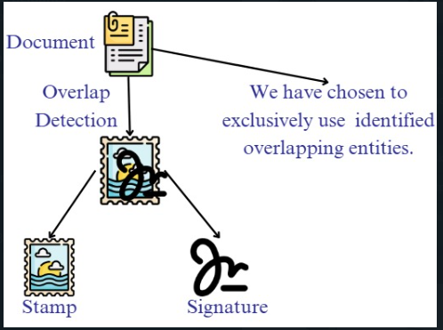
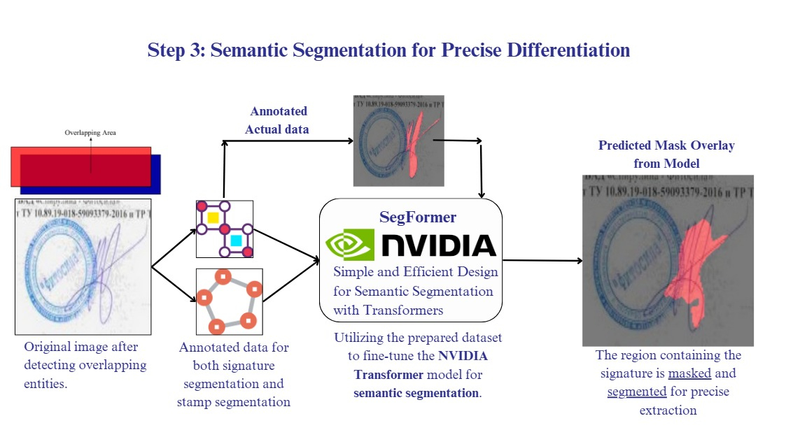
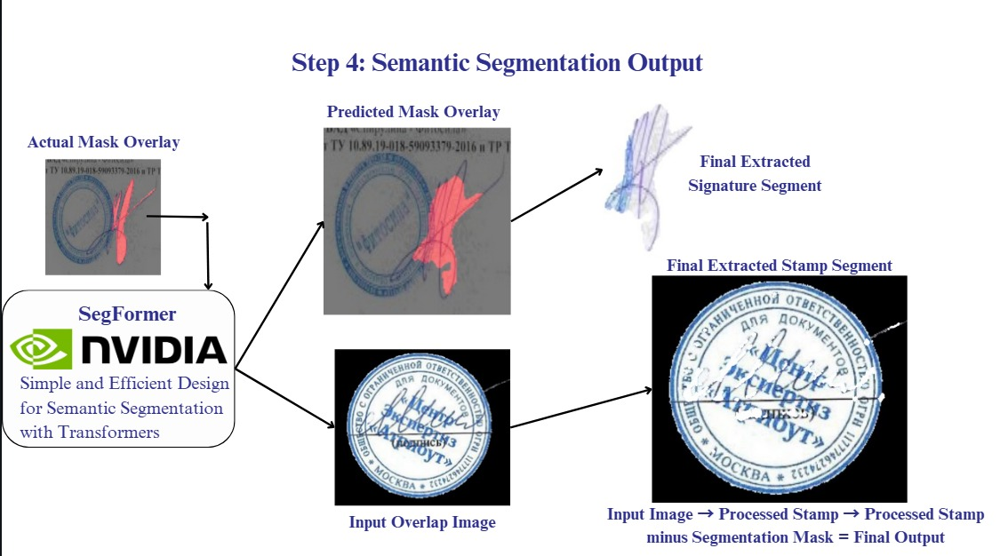
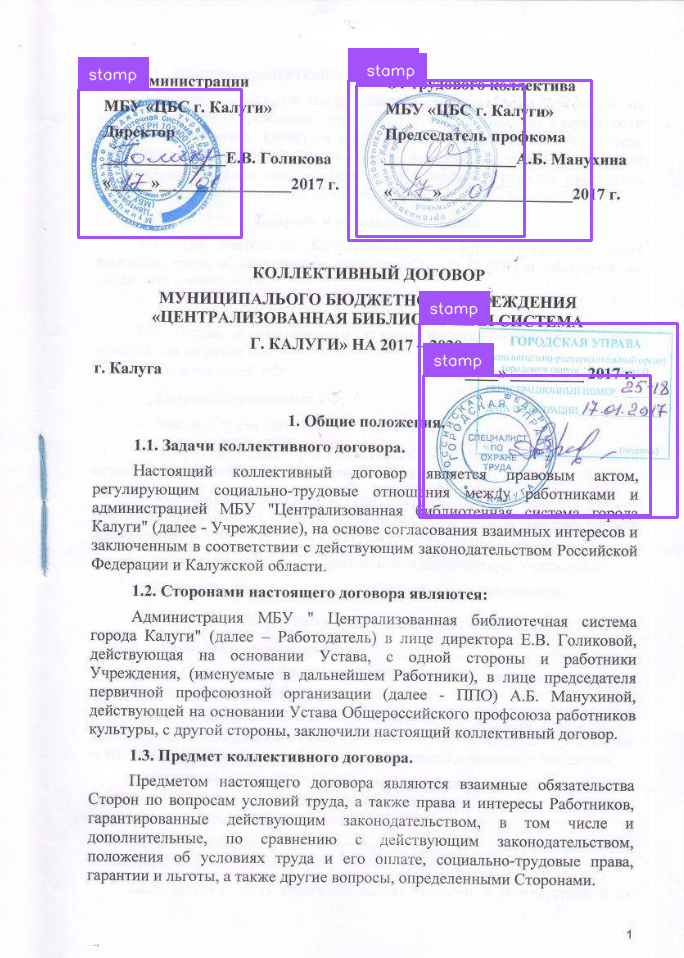
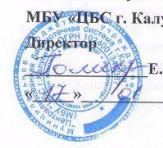
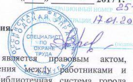
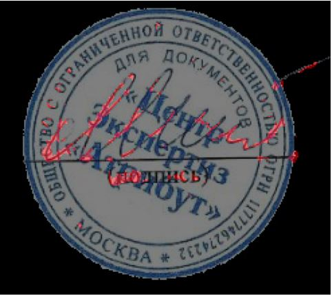

# StampExtractor

## Dataset used
https://www.kaggle.com/datasets/kumarshivam1411/segment-overlapping-sign-stamp

## Problem Statement

A comprehensive solution for extracting overlapping stamps and signatures from documents using YOLO object detection and Nvidia's SegFormer for semantic segmentation, followed by advanced image processing techniques. This project is the result of the collective efforts of Shivam, Arin, Varad, and Yasir for the AIQoD hackathon organized at VIT Chennai.

## Overview  

StampExtractor is a document processing tool designed to:  

- Upload PNG documents for analysis.  
- Process images using a pre-trained YOLO model for object detection to identify regions where overlapping stamps are present.  
- Apply semantic segmentation to accurately segment signatures.  
- Remove signatures using color segmentation, masking, and advanced image processing techniques.  
- Provide a user-friendly web interface for seamless interaction.

## Features

- **High Performance Detection**: Trained YOLOv12 model achieves mAP50 of 0.825 and mAP50-95 of 0.448
- **Complete Training Pipeline**: Includes data preparation, model training, evaluation, and inference
- **Streamlit Web Application**: User-friendly interface for uploading and analyzing documents

## Model Performance

- **mAP 50:95**: 0.448
- **mAP 50**: 0.825
- **mAP 75**: 0.418
### Final Model Metrics:
> Test Loss: 0.1441  
> Test IoU: 0.6779  
> Test Accuracy: 0.7385  

## Workflow

### Step 1: Document Upload Interface

### Step 2: Document Processing

### Step 3: Semantic Segmentation for Precise Differentiation

### Step 4 : Semantic Segmentaion and Signature Removal Using  Color Segmentation and Masking

## Workflow Demonstration

### Step 1.1: Input Document

### Step 1.2: Stamp and Sign Recognition

### Step 1.3: ROI Extraction

### Step 2: Signature Segmentation

### Step 3.1: Signature Seperation
  

Signature Heatmap  

### Step 3.2: Stamp Separation

## Dataset

The dataset comprises document images containing stamps, created and managed through Roboflow:
- 1,422 training images
- 82 validation images
- Test set for model evaluation

## Metrics

## References

- [Roboflow Notebooks](https://github.com/roboflow/notebooks) - Example notebooks and resources for object detection and Finetuning

## License

This project is licensed under the  MIT license - see the LICENSE file for details.
